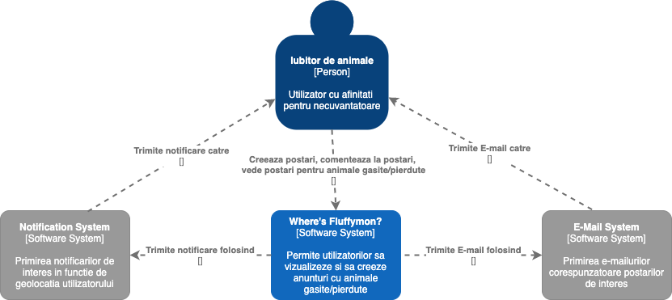
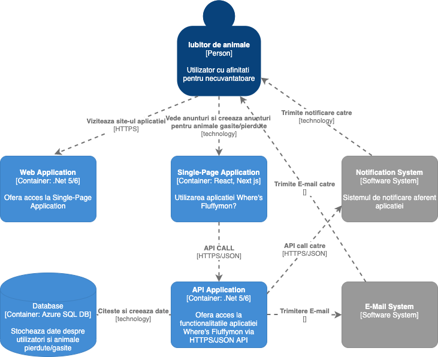
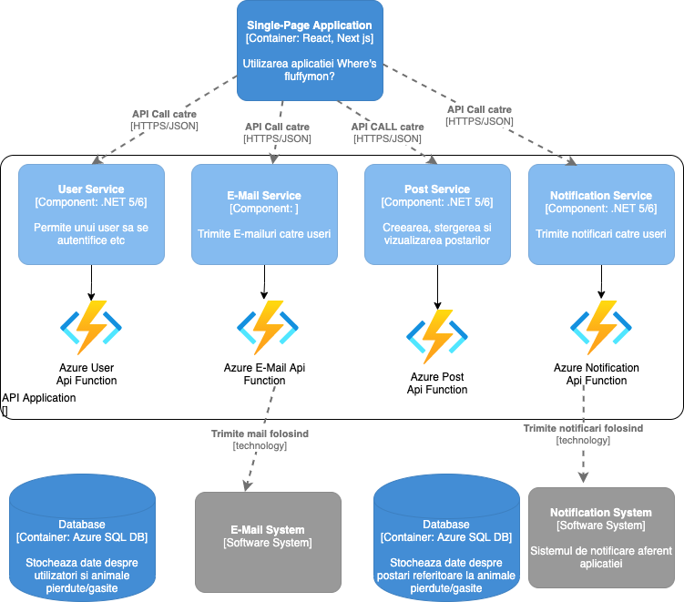
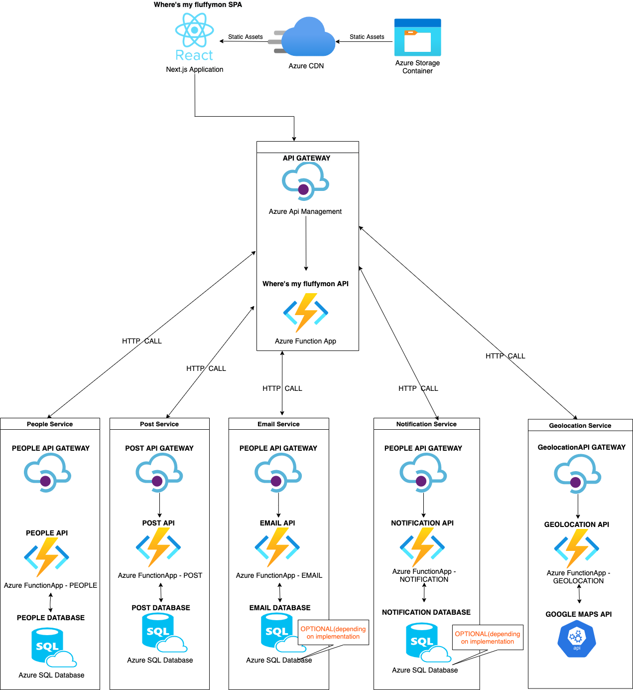

# Where's Fluffymon?

## Description
A service describing missing pets, pet rewards (brokered/managed by the service), and location data points (GPS) of pet sightings using augmented reality to overlay last-seen pet locations

## Functional Requirements:
- users interested in finding pets register on the site
- anyone can see a list of pets missing near to their location
- pet finders can post 'pet found' messages (with mandatory photo proof) and collect rewards on confirmation from pet owners 
- users can comment on pet missing entries, offering data points (sighted, area checked with no results, etc)
- mobile device accessibility

## Additional Context:
- one of a host of AR services being launched by parent company
- local scalability (per-city), but possibly scaling out to other cities
- company wants to create a larger social community around pets
- potential ad revenue from partners like pet stores have the potential to make millions

## Non-functional Requirements: 
- Clean architecture
- Clean Code
- Scalability
- Unit Tests and Test Coverage over 80%
- APIs Performance

## Engineering: 
 ### C4 - Level 1
    
 
### C4 - Level 2 
 

### C4 - Level 3

### Architecture 

